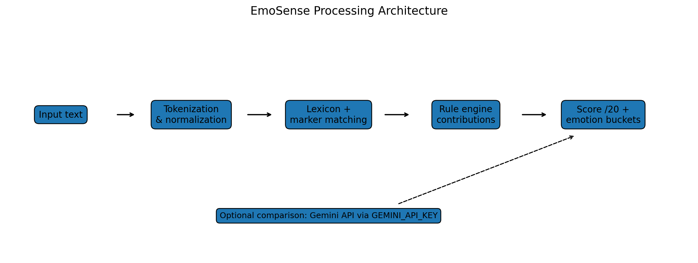
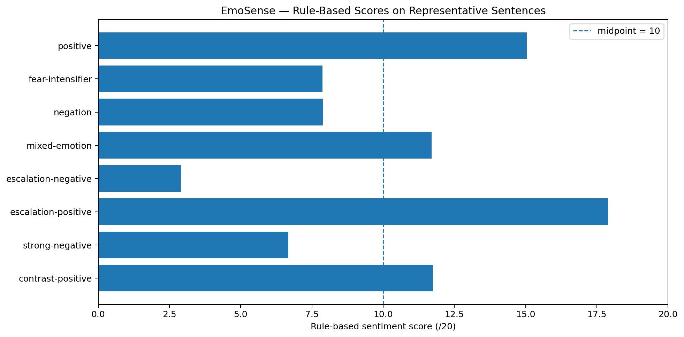
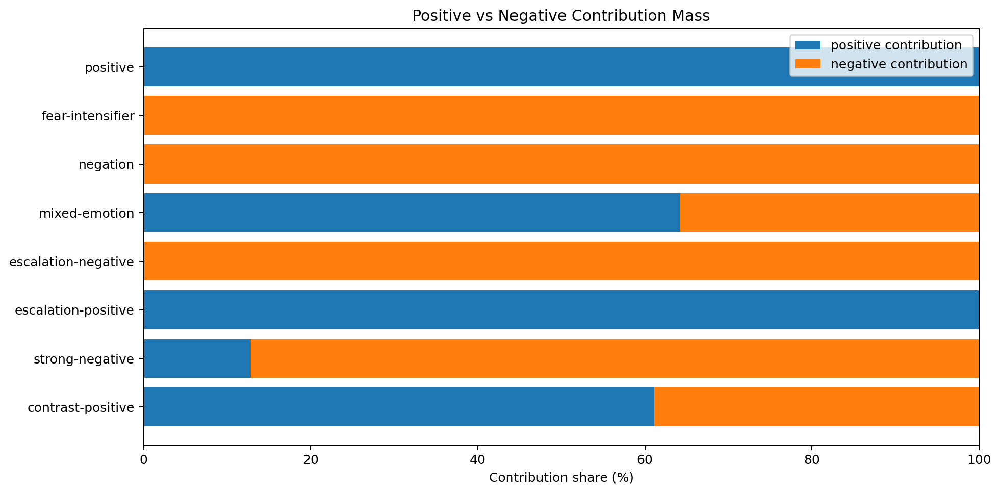
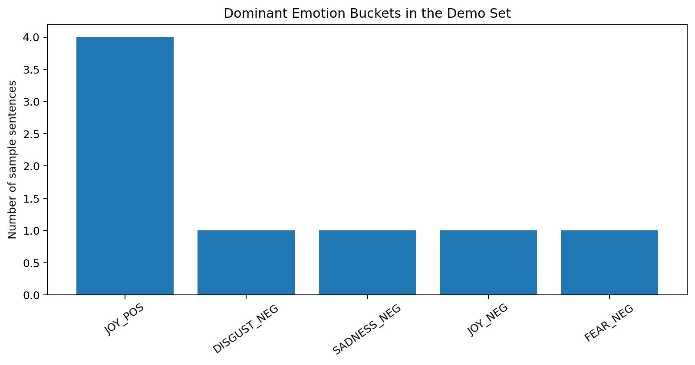
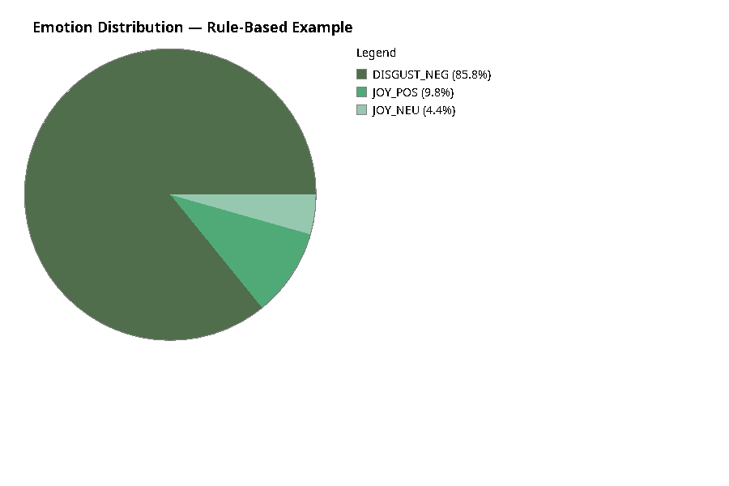

# EmoSense — Sentiment & Emotion Analysis in Java

EmoSense is a Java application for **sentiment and emotion analysis**. It compares two approaches:

1. a transparent **rule-based NLP engine** built from weighted emotion lexicons and linguistic markers;
2. an optional **external Gemini API analyzer** for contextual comparison.

The project was developed in GM3 at INSA Rouen Normandie as an object-oriented programming project, with emphasis on modular software architecture, interfaces and extensibility.

**Original project authors:** Manh Hung Nguyen and Tan Minh Duy Ngo.

## Overview

The rule-based pipeline identifies emotion cues, applies linguistic modifiers such as negation, intensification, contrast and escalation, and produces:

- a sentiment score on a 0–20 scale;
- positive and negative contribution percentages;
- a dominant emotion bucket;
- an interpretable list of cue-level contributions;
- JSON exports and PNG visualizations.

The external API path is optional. The project runs completely without an API key using the rule-based engine.

## Architecture



Main processing pipeline:

```text
Input text
   ↓
Tokenization & normalization
   ↓
Emotion lexicon + linguistic marker matching
   ↓
Rule engine
   ↓
Cue contributions
   ↓
Sentiment score + emotion distribution
```

The code is organized around a strategy-like interface (`IEmotionAnalyzer`) so that alternative analyzers can be added without changing the rest of the application.

## Rule-based scoring

For each detected emotional cue, the engine builds a signed contribution from:

- valence $v_i$;
- intensity $a_i$;
- contextual weight $w_i$.

The cue contribution is

$$
c_i = v_i a_i w_i.
$$

The raw sentence score is

$$
S = \sum_{i=1}^{m} c_i.
$$

To reduce dependence on sentence length, the raw score is normalized with

$$
S_{\max} = m\,w_{\max}a_{\max},
$$

then mapped to a 0–20 score through a hyperbolic tangent:

$$
z = clip\left(\frac{S}{S_{\max}},-1,1\right),
$$

$$
y = \tanh(1.5z + 0.1),
$$

$$
\text{Score}_{20} = \operatorname{clip}(10 + 10y, 0, 20).
$$

The rule engine also models:

- **negation** (`not`, ...);
- **intensifiers / diminishers**;
- **contrast markers** such as `but` and `yet`;
- **escalation structures** such as `not only ... but also ...`;
- **capitalization**;
- **punctuation intensity**;
- interpolation between positive, negative and neutral variants of six emotion families.

## Example results

### Rule-based sentiment scores



### Positive vs negative contribution mass



### Dominant emotion buckets



### Emotion distribution for one example

Example sentence:

> The staff was friendly, but the food was absolutely disgusting.



The corresponding structured output is available in [`results/json/sample_rule_analysis.json`](results/json/sample_rule_analysis.json).

## Repository structure

```text
emosense-sentiment-analysis/
├── src/
│   ├── main/
│   │   ├── java/
│   │   │   ├── api/          # optional external AI analyzer
│   │   │   ├── app/          # interactive app and batch demo
│   │   │   ├── core/         # lexicon, text processing, rule engine
│   │   │   ├── interfaces/   # analyzer abstraction
│   │   │   ├── io/           # JSON, charts, logs, explanations
│   │   │   └── model/        # domain objects and enums
│   │   └── resources/
│   │       └── lexicons/
│   └── test/
│       └── java/
├── scripts/
│   └── generate_figures.py
├── results/
│   ├── data/
│   ├── figures/
│   └── json/
├── docs/
│   ├── report.pdf
│   └── original-test-cases.txt
├── Makefile
├── requirements-figures.txt
└── .env.example
```

## Requirements

- **JDK 11+** (`java.net.http.HttpClient` is used by the optional API analyzer)
- Python 3 + Matplotlib only if you want to regenerate the summary figures

## Build

```bash
make compile
```

Compiled classes are written to `build/classes/`.

## Run the interactive application

```bash
make run
```

Without an API key, the Gemini comparison is skipped automatically and the rule-based analyzer remains fully functional.

## Run the reproducible rule-based demo

```bash
make demo
```

This generates:

- `results/data/sample_scores.csv`;
- `results/json/sample_rule_analysis.json`;
- `results/figures/emotion_pie_rule.png`.

## Regenerate all figures

```bash
python3 -m pip install -r requirements-figures.txt
make figures
```

## Tests

```bash
make test
```

The smoke tests check representative positive, negative, negated and contrast-based sentences.

## Optional Gemini API comparison

The API key is deliberately **not stored in the source code**.

Set it locally:

```bash
export GEMINI_API_KEY="your_api_key_here"
make run
```

Never commit a real API key to Git.

## Technical concepts demonstrated

- Java object-oriented programming;
- interfaces and extensible analyzer architecture;
- rule-based NLP;
- lexicon-based sentiment analysis;
- n-gram matching;
- contextual weighting and negation handling;
- JSON export;
- programmatic PNG generation with Java AWT;
- external REST API integration with `HttpClient`;
- reproducible batch experiments and smoke testing.

## Academic documentation

The original project report is available in [`docs/report.pdf`](docs/report.pdf).
